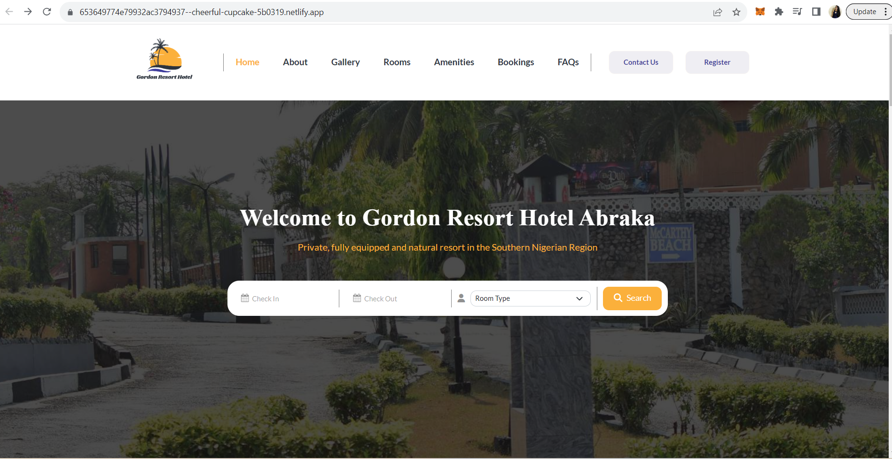
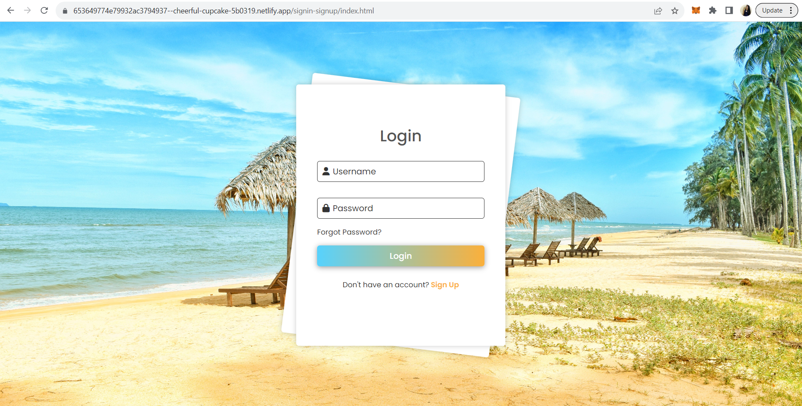
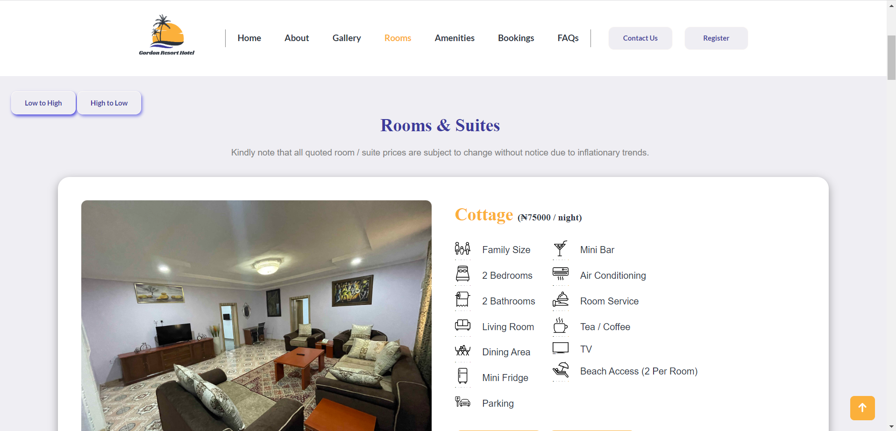
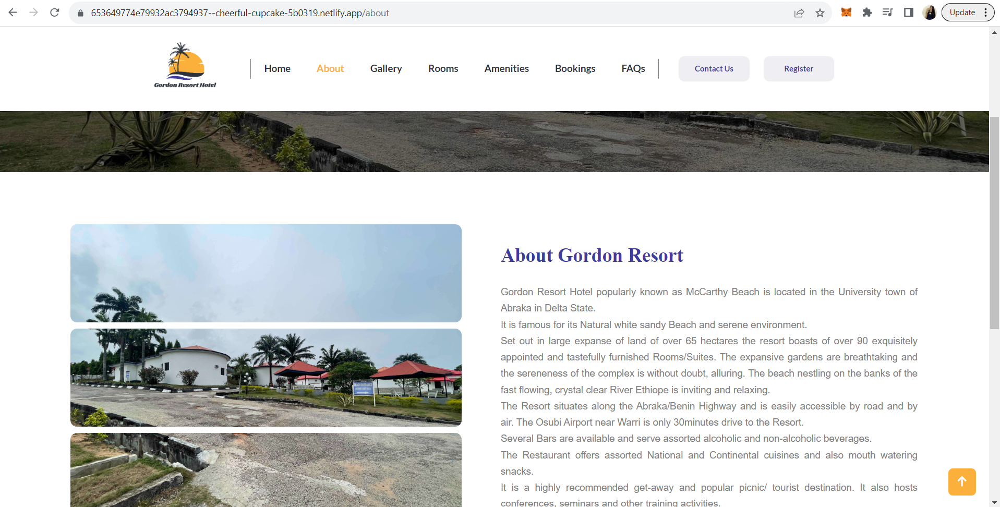
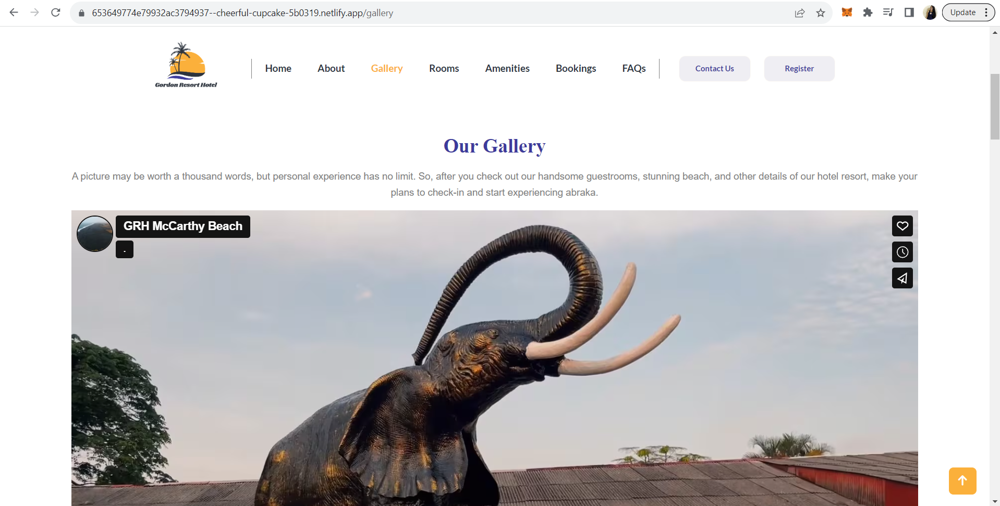
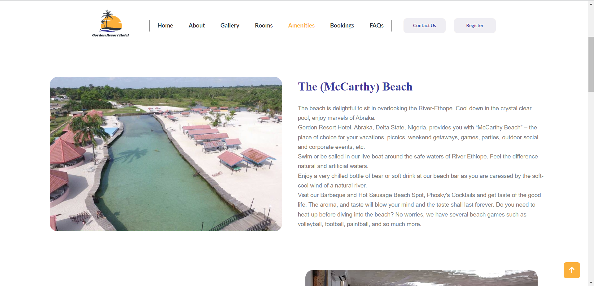
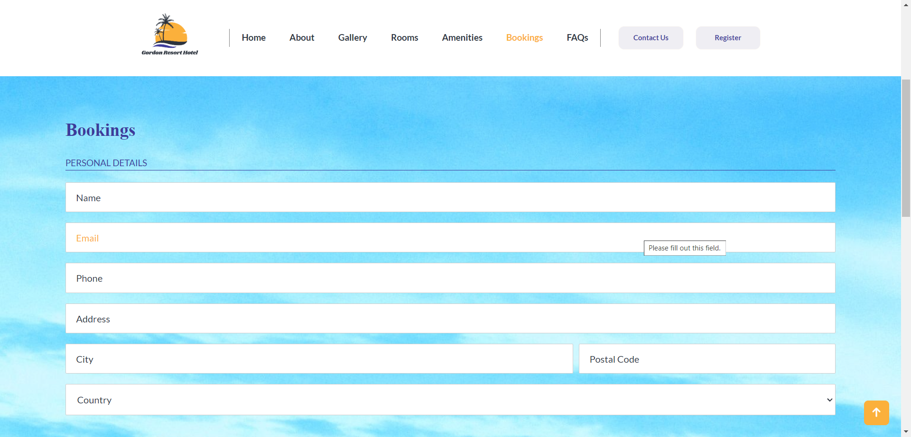
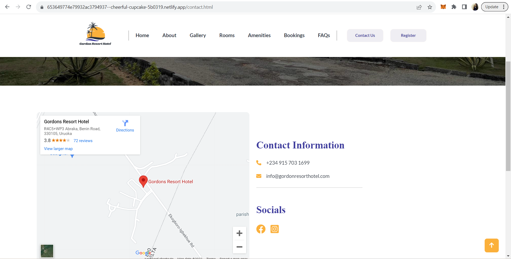
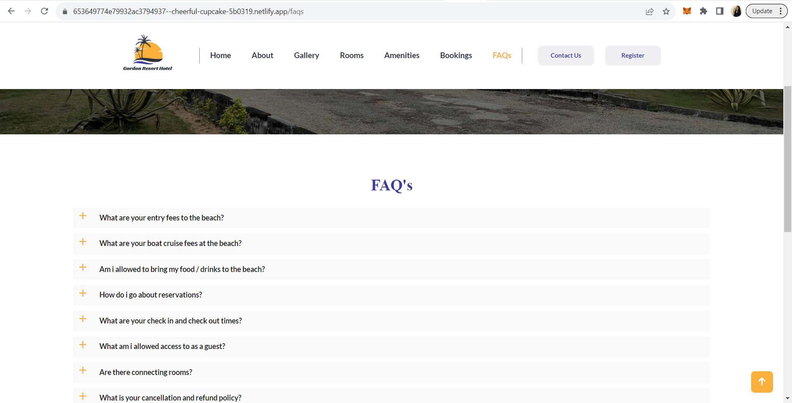
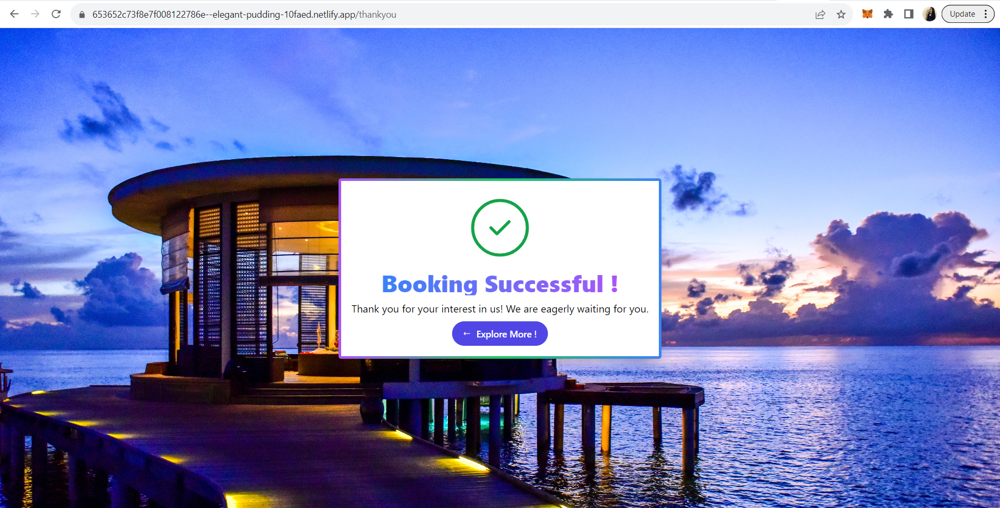

# glorious-calendar-2511
Welcome to our layout of Hotel Website.
# [Hotel Website](https://653652c73f8e7f008122786e--elegant-pudding-10faed.netlify.app/)

#  Welcome Here!

Hello Readers, 
It was during the final week which is depicted as the construct week. We have done this project with an amazing & enthusiastic group of 4 members and built a Hotel Website which deals in providing the users to get to know the hotel & accessing ease in the India   This Project is our construct week project in Unit-5 during our course of full stack developer. 
  I hope you will enjoy the reading…

##  Getting to know our Team Members: 

We formed a great team which attains great and humble minds, who are great team players and enthusiastic people.
this amazing team includes

- ## [Swati Mandal](https://github.com/swatii23)

- ## [Md Sajid](https://github.com/Sajid788)

- ## [Sachin Kumar Singh](https://github.com/sachin2398)

#  About Website: 

Our hotel website is a showcase of sophistication and convenience. Its intuitive interface guides visitors through a visual journey of our exquisite accommodations, tempting them with breathtaking images and detailed information. With seamless booking capabilities, personalized experiences, and engaging content, our website ensures that every guest's expectations are met even before they arrive. It's not just a platform; it's a portal to an unforgettable stay, inviting guests to explore, dream, and book with ease.

#  Tech Stack Used: 

We have used Html5, CSS, Advance JavaScript,Local Storage for building this Project. We also used tools like GitHub for collaboration of our project, Slack & Zoom as means of a communication channel.

#  Details of Tech stack used: 

<b>HTML5:</b>

we have used to build the basic structure of the website. All headings, Paragraphs, links, forms, etc. were structured by HTML.

 <b>CSS:</b>

We have used to add styling to the website. We used Advance CSS for Popup Modal window for login/Sign up, Payment, and all other styling.

 <b> Advance JavaScript:</b>

We have used to add logical functionalities to the web pages like the on Click function. We have added all the functionalities.

<b> Local storage:</b>

We have used local-storage as a database for storing users’ data, products details, and cart details.

Let us share our experience, 
This entire journey of making the project was awesome. We have learned lots of things by applying to the real website and it gave us a lot of confidence. there were some more functionalities that could have been done, yeah the time didn’t permit us to go further. But we will surely improve it during the course of time in future .

## So jurney started from here!

### Snapshots of our project :- 

- ##  Home Page 

 - ##  Login/Signup Page

 

- ##  Rooms Pages

- ##  About Page

 

 - ##  Gallery Page

 

 - ##  Amenities Page

 

- ##  Booking Page

 

 - ##  Contact Us Page

 

- ##  FAQ Page

 

 - ##  Thank You Page

 
 

 
 
 

  

# Presentation Video: 
Please refer to the [video](https://drive.google.com/file/d/1lHhHqCuQ6_QtstES7Cxlt7fnuz6O7BZQ/view?usp=sharing) for the presentation of our project.

# Our Journey: 
As this is our second project work on this course journey but we were not fimiliar with each other so our first day gone in discussion about how should we start, who did which work  and what are our strength and weaknesses regarding this. On next day finally we decided our role and distributed the respective work.
On the second day we started with a small discussion and decided the deadline to complete the whole project and start working on it, In evening stand-up we discussed our challenges and problem and tried to resolve them.
For next three days we have the same routine and finally on the sixth day our given task is ready but when we merge the all parts and resolved some minor bugs that were highlighted after merging.
There were some changes that need to be done and we all did it and finally, we record our presentation and Submit.
 

# Conclusion: 
We are very thankful for the support of our teammates, instructor(Adarsha Khatua) & IA(Pavan Ambulkar) for the completion of project in due time. We will look forward to add some feature and functionality which we left in this project for future expensions.

#  Thank You For Reading 
